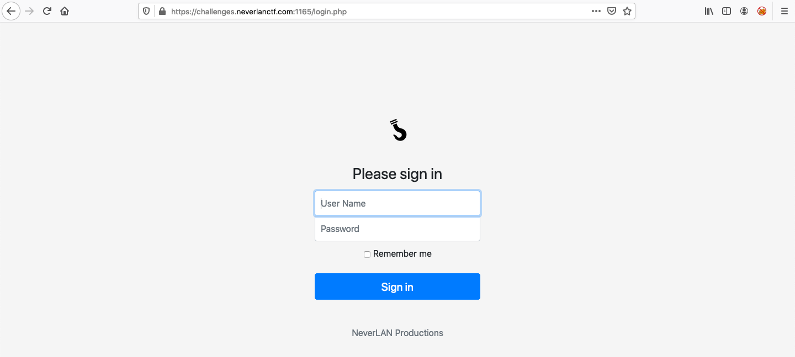
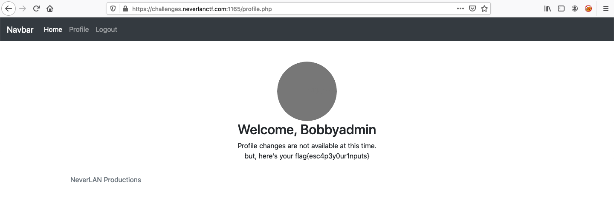

Seguindo boas práticas de CTF, e sempre olhar a descrição da chall ou box. Nesse caso, não temos nenhuma descrição que possa nos servir de dica, porém o nome da Chall (SQL Breaker 2) já nos dar um bom norte.  


Acessando o nosso alvo temos a seguinte tela de login.  



Como o próprio nome da Chall nos sugere, vamos começar realizando um ataque de SQL Injection, utilizando o seguinte payload no `username` e no `password`.  
**Payload:**
```sql
' or 1=1 or ''='
```


Conseguimos assim realizar login, porém este é um usuário limitado, pois só o admin consegue ler a flag.  
Dessa maneira não foi possível pegar a flag, mas já sabemos onde temos uma vulnerabilidade de SQL.  

Vamos dar uma turbinada no nosso payload, dessa vez tentando pegar melhores permissões.

**Payload:**
```sql
' or exists(select column_name from information_schema.columns where table_schema=database() and ascii(SUBSTR(PASSWORD,1,1))>100 limit 0,1) or ''='
```



E pra alegria da criança infantil, capturamos nossa flag. Fim de jogo!


**FLAG:** `flag{esc4p3y0ur1nputs}`
