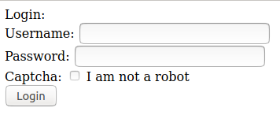
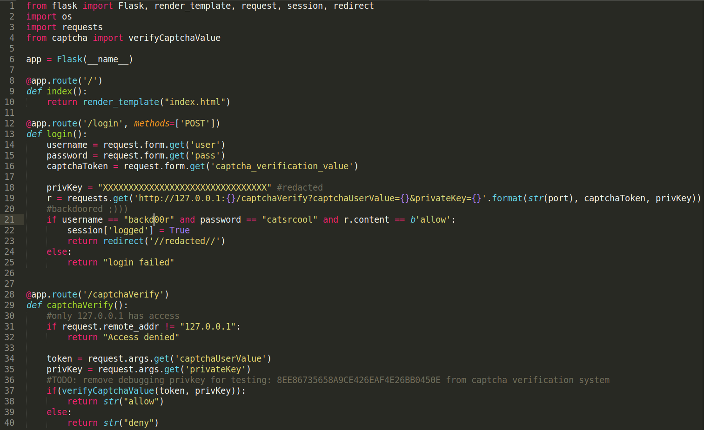
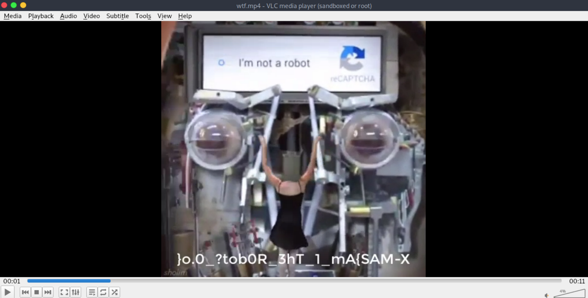

# Roboworld

**Categoria:** Web

# Descrição:
A friend of mine told me about this website where I can find secret cool stuff. He even managed to leak a part of the source code for me, but when I try to login it always fails :(

Can you figure out what's wrong and access the secret files?

Remote server: http://challs.xmas.htsp.ro:11000
Files: leak.py
Author: Reda


# Solução
Como premissa de uma flag web, primeiro vamos acessar nosso alvo via browser para vermos o que será retornado.



Então temos aqui uma tela de login onde podemos tentar alguns tipos de injections, mas antes vamos dar uma olhada no arquivo `leak.py` que foi disponibilizado.



Fazendo um code review, podemos pegar o usuário/senha (linha 21) e a chave privada (linha 36) que está sendo substituída por uns `XXXXXXXXXXXXXX`, deixando assim a chave sempre inválida. Testando essa combinação de usuário e senha na página web, não obtive um bom retorno, então analisei o código novamente e descobri uma falha na linha 19, que é possível inserir o valor `{}` para alterar a atribuição do valor e é nesse ponto que iremos atacar para explorar essa falha.


> Payload: 
user=backd00r&pass=catsrcool&captcha_verification_value=GlHgspeIs2%26privateKey=8EE86735658A9CE426EAF4E26BB0450E%26test={}&remote_addr=127.0.0.1&captchaUserValue=GlHgspeIs2&privateKey=8EE86735658A9CE426EAF4E26BB0450E&privKey=8EE86735658A9CE426EAF4E26BB0450E


Bingo, conseguimos passar dessa parte, porém estamos recebendo uma mensagem de `access denied`, o que não é muito bom. 


Reparando melhor na tela antes do redirecionamento, podemos ver que foi criada uma sessão que se perde depois de nos redirecionar. Vamos então colocar esse cookie manualmente para corrigir esse problema.


Bom, agora temos 3 arquivos interessantes que devemos analisar.  Nas duas imagens, não encontrei nada de interessante, mas no vídeo encontrei a solução do meu problema, a valiosa flag.




Obviamente ela não está no formato correto pois está invertida, mas para corrigir vamos executar o comando `echo -n '}o.0_?tob0R_3hT_1_mA{SAM-X' | rev`


Mission Complete!! Mais uma flag conquistada, é hora de comemorar.

Espero que esse writeup tenha sido útil.

Abs...


# Flag: 
```X-MAS{Am_1_Th3_R0bot?_0.o}```
